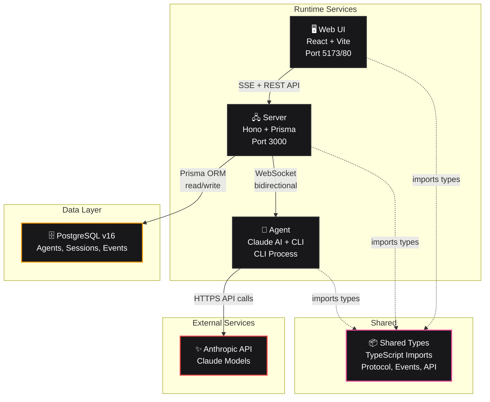
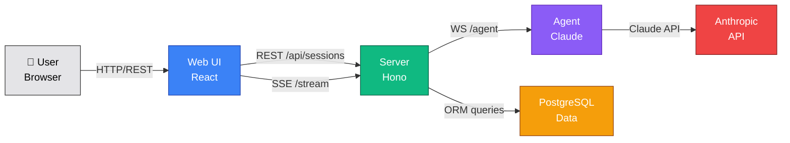

# Humanlayer Coding Agent — Architecture Diagram

## Mermaid Diagram



### Data Flow Diagram



## Key Connections (What EXISTS)

| From | To | Protocol | Purpose |
|------|-----|----------|---------|
| Web UI | Server | REST API | Create/list sessions, download workspace |
| Web UI | Server | SSE | Real-time event streaming |
| Server | Agent | WebSocket | Task assignment, heartbeat, event reporting |
| **Server** | **PostgreSQL** | **Prisma ORM** | **Persistent state (agents, sessions, events)** |
| Agent | Anthropic API | HTTPS | Claude model inference & tool execution |
| All packages | Shared Types | TypeScript imports | Type-safe contracts |

## Key Connections (What Does NOT Exist)

| Component A | Component B | Why Not |
|------------|------------|---------|
| **Agent** | **PostgreSQL** | ❌ Agent is stateless; Server handles all persistence |
| **Web UI** | **PostgreSQL** | ❌ Web UI never queries DB directly; Server is the gateway |
| **Web UI** | **Agent** | ❌ No direct connection; Server mediates all communication |
| **Web UI** | **Anthropic API** | ❌ Web UI never calls Claude directly; Agent owns this |
| **Agent** | **Agent** | ❌ Single agent model; only one agent connects at a time |

### Critical Architectural Boundary

**The Server is the ONLY component that accesses PostgreSQL.**

- ✅ Server reads/writes to PostgreSQL via Prisma ORM
- ❌ Agent never touches the database (it's ephemeral)
- ❌ Web UI never queries the database directly
- ❌ All database access is mediated through the Server's REST API

## Component Details

### Web UI (React + Vite)
- **Responsibilities**: Session management UI, real-time event display, workspace download
- **Connections**: SSE stream from Server for events, REST API for CRUD operations
- **Port**: 5173 (dev), 80 (prod/nginx)

### Server (Hono + Prisma)
- **Responsibilities**: API orchestration, WebSocket gateway, event streaming, state persistence
- **Features**:
  - REST endpoints for sessions & agents
  - WebSocket server for agent connections
  - SSE streaming to connected browsers
  - PostgreSQL integration via Prisma
- **Port**: 3000

### Agent (Claude AI CLI)
- **Responsibilities**: Run agentic loop, execute tools, manage workspace
- **Features**:
  - Claude API integration
  - File I/O, shell execution, directory listing
  - Per-session workspace isolation
  - Multi-turn conversation support
- **Port**: None (CLI process, connects to Server via WebSocket)

### PostgreSQL v16
- **Stores**: Agents, Sessions, Events tables
- **ORM**: Prisma (schema-driven migrations)
- **Port**: 5432

### Shared Types (TypeScript)
- **Protocol types**: WebSocket message contracts
- **Event types**: SSE event definitions
- **API types**: REST endpoint contracts
- **Imported by**: All packages (zero runtime dependencies)

### Anthropic API (External)
- **Claude model inference** via @anthropic-ai/sdk
- **Tool definitions** for agent execution
- **Context window management** (200k token limit)

## Docker Compose Services

```yaml
postgres:16-alpine     # Database backend
server (Node.js)       # HTTP/WS orchestration
agent (Node.js CLI)    # Agentic executor
web (nginx)            # React frontend
```

All services share `/workspace` volume for per-session file isolation.

## Data Flow Example: Session Creation

```
User creates session in Web UI
    ↓
POST /api/sessions (REST)
    ↓
Server stores session in PostgreSQL
    ↓
Server sends session:assign via WebSocket to Agent
    ↓
Agent processes prompt with Claude API
    ↓
Agent emits events via WebSocket
    ↓
Server broadcasts events via SSE
    ↓
Web UI receives and displays events in real-time
```

## Key Design Principles

1. **Single Agent Model**: Only one agent connected at a time (singleton pattern)
2. **Per-Session Isolation**: Each session gets its own `/workspace/{sessionId}` directory
3. **Real-time Streaming**: WebSocket for agent communication, SSE for UI updates
4. **Type Safety**: Shared TypeScript types across all packages
5. **Prisma Migrations**: Schema-driven database management
6. **Multi-turn Support**: Session history reconstructed from event logs

---

For detailed architecture analysis, see the conversation context or run: `npm run dev`
